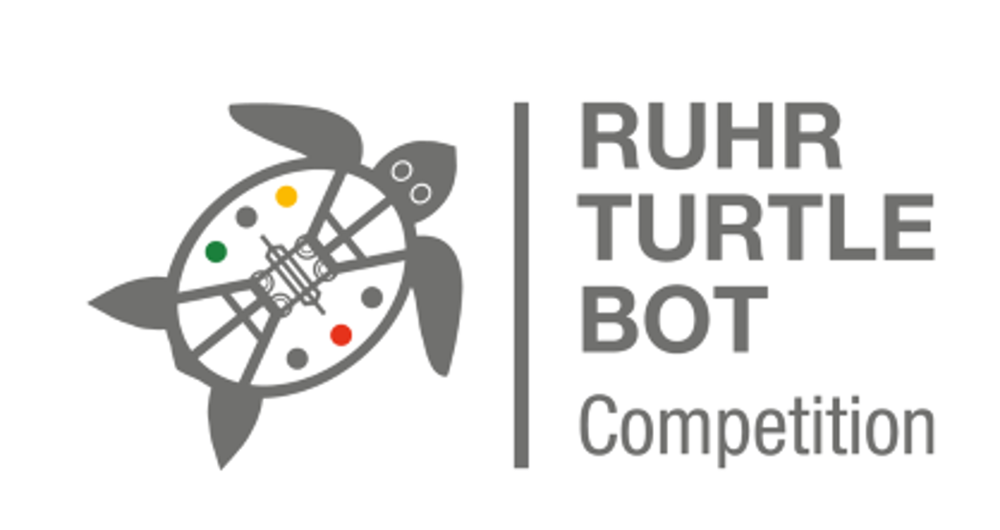

## Ruhr Master School - RMS:
### Ruhr-TurtleBot-Competition-RTC -  `README.md`
#### ---------------------------------------------------------------
#### Hochschulübergreifender Roboterwettbewerb für den TurtleBot3
##### (PC mit Ubuntu 20.4 - Focal Fossa  notwendig)
### -----------------------------------------------------------------

  

  

## Lizenz 
Für dieses Repository wird hauptsächlich die MIT-Lizenz verwendet (siehe unten)
Ausgeschlossen hiervon ist der offizielle Code des TurtleBot3, welcher unter die Apache License 2.0 fällt (siehe https://www.turtlebot.com/opensource/) 

MIT License is valid for all my files in this repository

Copyright (c) [2022] [Olaf Just]

Permission is hereby granted, free of charge, to any person obtaining a copy
of this software and associated documentation files (the "Software"), to deal
in the Software without restriction, including without limitation the rights
to use, copy, modify, merge, publish, distribute, sublicense, and/or sell
copies of the Software, and to permit persons to whom the Software is
furnished to do so, subject to the following conditions:

The above copyright notice and this permission notice shall be included in all
copies or substantial portions of the Software.

THE SOFTWARE IS PROVIDED "AS IS", WITHOUT WARRANTY OF ANY KIND, EXPRESS OR
IMPLIED, INCLUDING BUT NOT LIMITED TO THE WARRANTIES OF MERCHANTABILITY,
FITNESS FOR A PARTICULAR PURPOSE AND NONINFRINGEMENT. IN NO EVENT SHALL THE
AUTHORS OR COPYRIGHT HOLDERS BE LIABLE FOR ANY CLAIM, DAMAGES OR OTHER
LIABILITY, WHETHER IN AN ACTION OF CONTRACT, TORT OR OTHERWISE, ARISING FROM,
OUT OF OR IN CONNECTION WITH THE SOFTWARE OR THE USE OR OTHER DEALINGS IN THE
SOFTWARE.

## Installation ##

Installation von ROS Noetic und Konfiguration der `.bashrc` mit dem Shellskript  `ros_noetic_install_skript.sh`
use: 
 >$ chmod +x ros_noetic_install_skript.sh        
 >$ ./ros_noetic_install_skript.sh

Rechner neu starten, 
dann Installation der TurtleBot3 - Pakete =>   

>$ turtle_package_install_skript.sh

Rechner neu starten, 
dann kompilieren der TurtleBot3 - Pakete

>$ cd ~/catkin_ws 
>$ catkin_make

#### Simulation in Gazebo mit Haus-Modell - Aufruf der Launch-Files:
##### Gazebo-3D-Simulation:      
    >$ roslaunch turtlebot3_gazebo turtlebot3_house.launch
##### Tastatursteuerung:         
    >$ roslaunch turtlebot3_teleop turtlebot3_teleop_key.launch    
##### Aufnahme einer Karte (SLAM):
    >$ roslaunch turtlebot3_slam turtlebot3_slam.launch slam_methods:=gmapping
##### Speichern der Karte:    
    >$ rosrun map_server map_saver -f /home/oj/catkin_ws/src/rtc/rtc_maps/gazebo_house_map
##### Navigation zum Goal:
    Falls Gazebo noch nicht gestartet:
    >$1 roslaunch turtlebot3_gazebo turtlebot3_house.launch
    >$2 roslaunch turtlebot3_navigation turtlebot3_navigation.launch \
                  map_file:=$HOME/catkin_ws/src/rtc/rtc_maps/gazebo_house_map.yaml    

!!  Navigation und Slammen funktioniert bislang nicht gleichzeitig

roslaunch turtlebot3_gazebo turtlebot3_house.launch
roslaunch turtlebot3_navigation turtlebot3_navigation.launch map_file:=$HOME/catkin_ws/src/rtc/rtc_maps/gazebo_house_map_2020_12_07.yaml

## Credits
* [ROBOTIS](https://github.com/ROBOTIS-GIT/turtlebot3)

